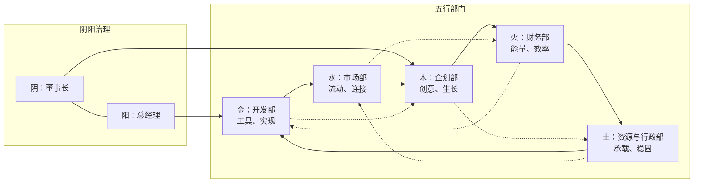

# 治理原则图示（阴阳五行协同图）

> 以阴阳为纲、五行为目，构建有生命力的现代 AI 公司治理体系。

## 核心理念
- 阴（董事长）定方向与价值观；阳（总经理）促执行与协同。
- 五行部门相生相克、动态平衡：木（企划）→ 火（财务）→ 土（资源与行政）→ 金（开发）→ 水（市场）→ 木（企划）。

## 协同关系示意（Mermaid）

## 说明
- 阴阳互济：战略与执行相辅相成，形成稳定与活力并存的治理结构。
- 相生循环：以创意驱动价值、以能量凝聚秩序、以组织孕育技术、以工具促进连接、以市场滋养创意。
- 相克约束：通过制度与度量防止失衡与内耗，保障系统健康发展。

## 实施要点
- 目标与价值由“人”定义，流程与实现由“AI”赋能。
- 用数据与审计形成反馈闭环，驱动持续优化与迭代。
- 鼓励跨部门协作与知识共享，构建学习型组织。