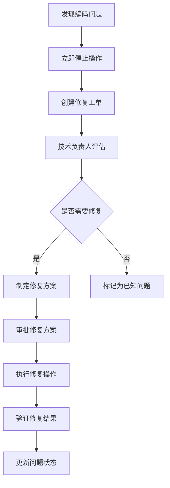

# 文件编码规范

> 版本：V1.0
> 制定部门：开发部（金）
> 适用范围：YDS-Lab全项目文件

## 1. 文件编码标准

### 1.1 统一编码格式
- **所有源代码文件必须使用UTF-8无BOM格式编码**
- **配置文件统一使用UTF-8编码**
- **文档文件推荐使用UTF-8编码**

### 1.2 不同文件类型编码要求

| 文件类型 | 扩展名 | 编码要求 | 特殊说明 |
|---------|--------|----------|----------|
| Python源码 | .py | UTF-8无BOM | 必须在文件头添加`# -*- coding: utf-8 -*-` |
| JavaScript/TypeScript | .js/.ts/.tsx | UTF-8无BOM | 推荐在package.json中指定`"charset": "utf-8"` |
| Shell脚本 | .sh/.bash | UTF-8无BOM | 必须在文件头添加`#!/bin/bash`和`# -*- coding: utf-8 -*-` |
| 批处理文件 | .bat/.cmd | UTF-8无BOM | Windows系统下建议使用GBK兼容模式 |
| Markdown文档 | .md | UTF-8无BOM | 统一标准，避免跨平台乱码 |
| JSON配置文件 | .json | UTF-8无BOM | 标准JSON格式要求 |
| YAML配置文件 | .yml/.yaml | UTF-8无BOM | 避免特殊字符解析错误 |
| XML配置文件 | .xml | UTF-8无BOM | 必须在XML声明中指定`encoding="UTF-8"` |
| CSS样式文件 | .css | UTF-8无BOM | 推荐在文件头添加`@charset "UTF-8";` |
| HTML模板文件 | .html/.htm | UTF-8无BOM | 必须在meta标签中指定`<meta charset="UTF-8">` |

### 1.3 特殊字符处理规则
- **禁止使用BOM（Byte Order Mark）头**
- **中文字符必须在UTF-8编码范围内**
- **特殊符号使用Unicode标准编码**
- **emoji表情符号谨慎使用，确保目标平台支持**

## 2. 开发管理要求

### 2.1 版本控制提交前的编码验证流程
```bash
# Git提交前必须执行以下检查：

# 1. 检查文件编码
file -i <filename>  # Linux/Mac
Get-FileEncoding <filename>  # Windows PowerShell

# 2. 检查BOM头
hexdump -C <filename> | head -n 1  # 查看前几个字节

# 3. 验证无BOM的UTF-8
python -c "import codecs; codecs.open('<filename>', encoding='utf-8-sig').read()"
```

### 2.2 IDE/编辑器配置标准

#### VS Code配置
在`.vscode/settings.json`中添加：
```json
{
  "files.encoding": "utf8",
  "files.autoGuessEncoding": false,
  "files.eol": "\n",
  "editor.insertSpaces": true,
  "editor.tabSize": 2,
  "files.trimTrailingWhitespace": true,
  "files.insertFinalNewline": true
}
```

#### PyCharm配置
1. File → Settings → Editor → File Encodings
2. 设置：
   - Global Encoding: UTF-8
   - Project Encoding: UTF-8
   - Default encoding for properties files: UTF-8
   - 勾选"Transparent native-to-ascii conversion"

#### 其他编辑器通用要求
- 文件编码必须设置为UTF-8
- 换行符统一使用LF（\n）
- 禁止自动添加BOM头
- 文件末尾必须添加换行符

### 2.3 跨平台开发时的编码兼容性保障措施

#### Windows平台特殊处理
```batch
# 在Windows批处理文件开头添加：
@echo off
chcp 65001 > nul  # 设置控制台为UTF-8编码
```

#### Git配置
```bash
# 全局Git配置
git config --global core.autocrlf false
git config --global core.eol lf
git config --global i18n.commitencoding utf-8
git config --global i18n.logoutputencoding utf-8

# 在仓库的.gitattributes文件中添加：
* text=auto eol=lf
*.py text eol=lf
*.js text eol=lf
*.json text eol=lf
*.md text eol=lf
*.bat text eol=crlf  # Windows批处理文件使用CRLF
*.cmd text eol=crlf
```

## 3. 监控工具规范

### 3.1 工具部署要求
- **工具必须部署在`S:\YDS-Lab\01-struc\tools`目录下**
- **工具需要具备实时监控能力**
- **工具输出报告格式统一为JSON格式**

### 3.2 编码检测工具功能要求

#### 核心功能模块
1. **文件编码自动识别**
   - 支持批量文件扫描
   - 自动识别文件编码格式
   - 检测BOM头存在情况

2. **乱码文件自动标记**
   - 建立乱码文件黑名单
   - 自动生成标记报告
   - 提供文件路径和编码信息

3. **编码合规报告生成**
   - 生成HTML格式可视化报告
   - 包含统计图表和详细列表
   - 支持历史趋势对比

#### 工具使用示例
```bash
# 扫描整个项目
python encoding_checker.py --scan-dir S:\YDS-Lab --output report.html

# 检查特定文件类型
python encoding_checker.py --scan-dir S:\YDS-Lab --include "*.py,*.js,*.json" --strict

# 实时监控模式
python encoding_checker.py --watch --interval 60 --log encoding_watch.log
```

### 3.3 工具配置文件
在`S:\YDS-Lab\01-struc\tools\encoding_checker.conf`中配置：
```ini
[encoding_checker]
# 扫描目录
scan_dirs = S:\YDS-Lab\01-struc

# 包含的文件类型
include_patterns = *.py,*.js,*.ts,*.json,*.yml,*.yaml,*.md,*.txt,*.sh,*.bat,*.cmd

# 排除的目录
exclude_dirs = .git,__pycache__,node_modules,.vscode

# 编码要求
required_encoding = utf-8
allow_bom = false

# 报告设置
output_format = html
report_file = encoding_report.html
log_file = encoding_checker.log

# 监控设置
enable_watch = true
watch_interval = 300  # 5分钟
```

## 4. 执行流程

### 4.1 全项目扫描现有文件编码情况
```bash
# 执行全项目扫描
cd S:\YDS-Lab\01-struc\tools
python encoding_checker.py --full-scan --generate-report

# 扫描结果处理
if [ $? -ne 0 ]; then
    echo "编码检查失败，存在不符合规范的编码文件"
    exit 1
fi
```

### 4.2 发现乱码文件处理流程

#### 立即停止规则
```bash
# 一旦发现乱码文件，立即停止扫描并上报
# 乱码文件定义：
# 1. 非UTF-8编码的源代码文件
# 2. 包含BOM头的文件（除特殊要求外）
# 3. 编码检测失败的文件

# 自动停止脚本逻辑
if detect_encoding_issue(); then
    echo "ERROR: 发现编码问题文件"
    echo "文件路径: $problem_file"
    echo "检测编码: $detected_encoding"
    echo "期望编码: UTF-8"
    send_alert_to_team()
    exit 1
fi
```

#### 上报流程
1. **立即上报**：通过企业微信/钉钉发送告警消息
2. **详细记录**：在问题追踪系统中创建工单
3. **通知责任人**：通知文件最近修改人和项目负责人

### 4.3 严禁未经审批的自行修复操作

#### 修复审批流程


#### 修复操作规范
- **备份原文件**：修复前必须创建备份
- **验证修复结果**：使用多种工具验证编码正确性
- **回归测试**：确保修复不影响文件功能
- **记录变更**：详细记录修复过程和原因

### 4.4 乱码问题处理SOP（标准操作流程）

#### SOP-001：编码问题发现与报告
```markdown
标准操作流程：编码问题发现与报告

目的：规范编码问题的发现、报告和处理流程

适用范围：YDS-Lab所有项目文件

操作步骤：
1. 发现问题
   - 使用encoding_checker工具扫描
   - 发现非UTF-8编码文件
   - 记录文件路径和编码信息

2. 立即停止
   - 停止相关开发工作
   - 保护现场环境
   - 通知项目组成员

3. 问题报告
   - 创建GitHub Issue
   - 标题格式：[ENCODING] 文件编码异常 - <文件路径>
   - 包含信息：
     * 文件路径
     * 检测编码
     * 文件内容预览（十六进制）
     * 发现时间
     * 操作人

4. 紧急评估
   - 技术负责人15分钟内响应
   - 评估影响范围
   - 确定处理优先级

5. 跟踪处理
   - 分配处理人员
   - 设定完成时限
   - 更新处理状态
```

#### SOP-002：编码修复操作
```markdown
标准操作流程：编码修复操作

目的：确保编码修复操作的安全性和正确性

前置条件：已获得修复审批，完成备份

操作步骤：
1. 备份原文件
   cp original_file backup/original_file.$(date +%Y%m%d_%H%M%S)

2. 编码转换
   # 使用iconv进行编码转换
   iconv -f detected_encoding -t utf-8 original_file -o converted_file
   
   # 或使用Python脚本
   python convert_encoding.py --input original_file --output converted_file --to utf-8

3. 验证转换结果
   # 检查文件编码
   file -i converted_file
   
   # 检查是否包含BOM
   hexdump -C converted_file | head -n 1
   
   # 内容完整性验证
   diff -u original_file converted_file

4. 功能测试
   - 执行相关单元测试
   - 运行集成测试
   - 验证业务功能

5. 提交变更
   - Git提交包含详细说明
   - 关联原始Issue
   - 通知相关人员

6. 更新文档
   - 更新编码检测报告
   - 记录修复经验
   - 完善预防措施
```

## 5. 质量保障

### 5.1 编码规范执行检查清单

#### 日常开发检查清单
- [ ] 新创建文件使用UTF-8无BOM编码
- [ ] 文件头包含正确的编码声明（如适用）
- [ ] 特殊字符使用Unicode标准编码
- [ ] 文件末尾包含换行符
- [ ] Git提交前执行编码检查

#### 代码审查检查清单
- [ ] 验证所有源代码文件编码正确
- [ ] 检查配置文件编码一致性
- [ ] 验证文档文件编码规范
- [ ] 确认无BOM头文件（除特殊要求外）

#### 发布前检查清单
- [ ] 全项目编码扫描通过
- [ ] 编码检测报告生成
- [ ] 无编码相关告警
- [ ] 历史问题已清理

### 5.2 编码验证纳入CI/CD流水线

#### GitHub Actions配置示例
```yaml
name: Encoding Check

on:
  push:
    branches: [ main, develop ]
  pull_request:
    branches: [ main, develop ]

jobs:
  encoding-check:
    runs-on: ubuntu-latest
    
    steps:
    - uses: actions/checkout@v3
    
    - name: Set up Python
      uses: actions/setup-python@v4
      with:
        python-version: '3.9'
    
    - name: Install encoding checker
      run: |
        pip install chardet
        pip install encoding-checker
    
    - name: Run encoding check
      run: |
        python S:\YDS-Lab\01-struc\tools\encoding_checker.py \
          --scan-dir . \
          --strict \
          --fail-on-issue
    
    - name: Upload encoding report
      uses: actions/upload-artifact@v3
      if: always()
      with:
        name: encoding-report
        path: encoding_report.html
```

#### Jenkins Pipeline配置
```groovy
pipeline {
    agent any
    
    stages {
        stage('Encoding Check') {
            steps {
                script {
                    def result = sh(
                        script: 'python S:\\YDS-Lab\\01-struc\\tools\\encoding_checker.py --scan-dir . --strict',
                        returnStatus: true
                    )
                    
                    if (result != 0) {
                        error "编码检查失败，发现编码不符合规范的文件"
                    }
                }
            }
        }
        
        stage('Generate Report') {
            steps {
                sh 'python S:\\YDS-Lab\\01-struc\\tools\\encoding_checker.py --scan-dir . --output encoding_report.html'
            }
        }
        
        stage('Archive Report') {
            steps {
                archiveArtifacts artifacts: 'encoding_report.html', allowEmptyArchive: false
            }
        }
    }
    
    post {
        failure {
            emailext (
                subject: "编码检查失败 - ${env.JOB_NAME} - ${env.BUILD_NUMBER}",
                body: "请检查编码报告并修复相关问题",
                to: "${env.CHANGE_AUTHOR_EMAIL}"
            )
        }
    }
}
```

### 5.3 定期审计机制

#### 月度全面检查流程
1. **第一周**：全项目文件编码扫描
2. **第二周**：编码问题分析和分类
3. **第三周**：问题修复和验证
4. **第四周**：编码规范优化和更新

#### 审计报告内容
- 编码合规率统计
- 问题文件清单
- 趋势分析图表
- 改进建议措施
- 下月工作计划

#### 审计结果处理
- **合规率≥95%**：继续保持，分享最佳实践
- **合规率80%-94%**：分析问题原因，制定改进计划
- **合规率<80%**：启动专项整改，加强培训指导

## 附录

### A. 相关工具下载链接
- [Notepad++](https://notepad-plus-plus.org/) - 免费文本编辑器，支持编码转换
- [VS Code](https://code.visualstudio.com/) - 微软免费代码编辑器
- [Sublime Text](https://www.sublimetext.com/) - 跨平台文本编辑器
- [iconv](https://www.gnu.org/software/libiconv/) - 字符编码转换工具

### B. 编码检测命令速查表
```bash
# Linux/Mac
file -i filename          # 查看文件编码和类型
hexdump -C filename | head  # 查看文件头字节
enca -L zh_CN filename    # 检测中文文件编码
iconv -l                  # 列出支持的编码

# Windows
Get-FileEncoding filename # PowerShell查看文件编码
[System.IO.File]::ReadAllBytes("filename") | Format-Hex # 查看字节内容
```

### C. 常见问题FAQ
**Q: 为什么不能使用BOM头？**
A: BOM头可能导致某些编译器或解释器解析错误，特别是在Unix-like系统中。

**Q: GBK和UTF-8如何选择？**
A: 新项目统一使用UTF-8，老项目逐步迁移到UTF-8，Windows批处理文件可使用GBK。

**Q: 如何批量转换文件编码？**
A: 使用iconv工具或Python脚本进行批量转换，但必须先备份原文件。

---

**制定**: YDS-Lab开发部（金）
**审核**: 技术委员会
**批准**: 总经理（阳）
**生效日期**: 2024年11月13日
**版本**: V1.0