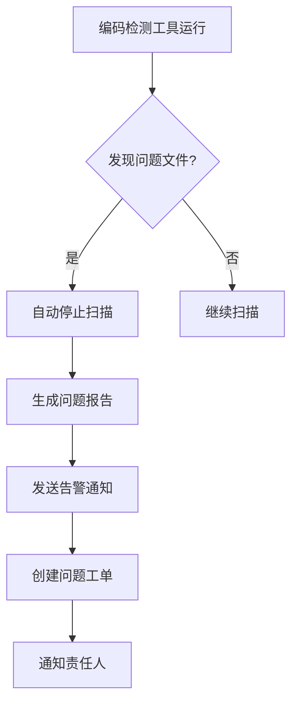
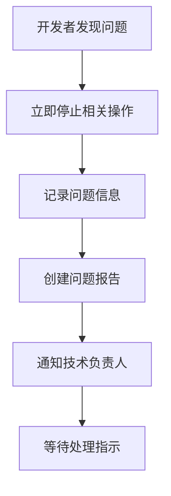
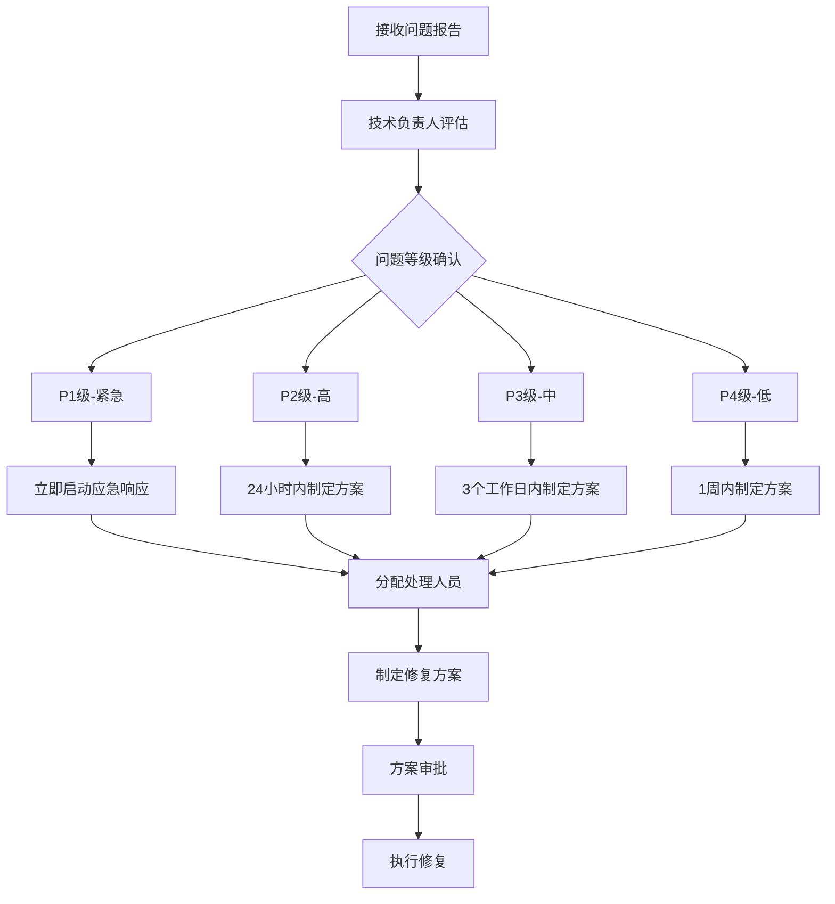
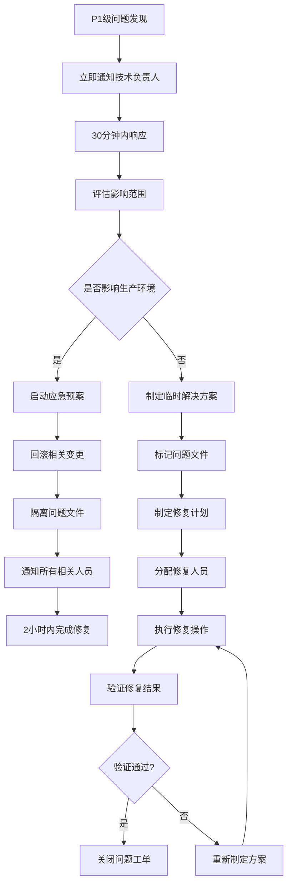
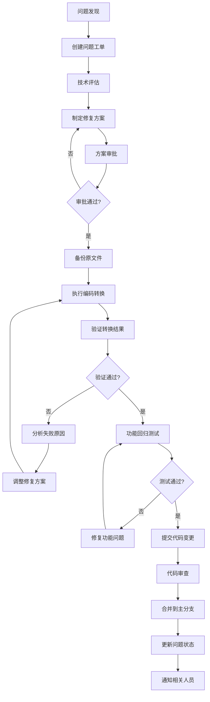

# 乱码问题处理SOP（标准操作流程）

> 文档编号：SOP-ENC-001
> 版本：V1.0
> 制定部门：开发部（金）
> 生效日期：2024年11月13日

## 1. 目的与适用范围

### 1.1 目的
规范YDS-Lab项目中文件编码异常（乱码）问题的发现、报告、评估和处理流程，确保编码问题得到及时、正确的解决，维护项目代码质量和团队协作效率。

### 1.2 适用范围
- 适用于YDS-Lab所有项目源代码文件
- 适用于所有配置文件和文档文件
- 适用于所有开发、测试、部署环境
- 适用于所有项目成员和外部协作者

## 2. 术语定义

| 术语 | 定义 |
|------|------|
| 乱码文件 | 编码格式不符合UTF-8无BOM规范的文件 |
| BOM头 | Byte Order Mark，字节顺序标记 |
| 编码检测 | 使用工具识别文件实际编码格式的过程 |
| 编码转换 | 将文件从一种编码格式转换为另一种编码格式的过程 |
| 合规文件 | 符合UTF-8无BOM编码规范的文件 |

## 3. 乱码问题分类与等级

### 3.1 问题分类
| 分类 | 描述 | 示例 |
|------|------|------|
| A类-严重 | 导致系统运行异常 | GBK编码的Python文件，包含中文注释 |
| B类-重要 | 影响代码可读性 | UTF-8带BOM头的配置文件 |
| C类-一般 | 潜在兼容性问题 | Windows批处理文件使用UTF-8编码 |
| D类-轻微 | 格式不规范 | 文件末尾缺少换行符 |

### 3.2 问题等级
| 等级 | 响应时间 | 解决时限 | 影响范围 |
|------|----------|----------|----------|
| P1-紧急 | 立即响应 | 2小时内 | 影响系统运行 |
| P2-高 | 4小时内响应 | 24小时内 | 影响开发效率 |
| P3-中 | 1个工作日内响应 | 3个工作日内 | 影响代码规范 |
| P4-低 | 3个工作日内响应 | 1周内 | 格式优化 |

## 4. 乱码问题发现流程

### 4.1 自动发现机制


### 4.2 手动发现流程


## 5. 乱码问题报告规范

### 5.1 问题报告模板
```markdown
【编码问题报告】

问题编号：ENC-{YYYYMMDD}-{序号}
发现时间：YYYY-MM-DD HH:MM:SS
发现人员：{姓名}
问题等级：{P1/P2/P3/P4}
问题分类：{A/B/C/D}

文件信息：
- 文件路径：{完整路径}
- 文件类型：{扩展名}
- 文件大小：{字节数}
- 最后修改：{时间}
- 修改人员：{姓名}

编码信息：
- 检测编码：{实际编码}
- 期望编码：UTF-8无BOM
- 是否含BOM：{是/否}
- 置信度：{百分比}

问题描述：
{详细描述问题的表现和影响}

影响分析：
- 影响范围：{影响的模块/功能}
- 严重程度：{高/中/低}
- 紧急程度：{高/中/低}

环境信息：
- 操作系统：{Windows/Linux/Mac}
- 编辑器：{VS Code/PyCharm/其他}
- Git状态：{已提交/未提交/已推送}

附加信息：
- 文件内容预览（十六进制）：{前64字节}
- 错误日志：{相关错误信息}
- 截图：{如有必要}
```

### 5.2 报告提交渠道
1. **紧急问题**：立即电话/企业微信通知技术负责人
2. **一般问题**：通过GitHub Issues创建工单
3. **批量问题**：发送邮件至tech-lead@yds-lab.com

## 6. 乱码问题评估流程

### 6.1 技术评估


### 6.2 影响评估要素
| 评估要素 | 权重 | 评估标准 |
|----------|------|----------|
| 系统稳定性 | 40% | 是否导致系统崩溃/异常 |
| 开发效率 | 30% | 是否影响开发进度 |
| 数据完整性 | 20% | 是否造成数据丢失/损坏 |
| 用户体验 | 10% | 是否影响最终用户体验 |

### 6.3 风险评估
```markdown
风险评估矩阵：

影响程度 \ 发生概率 | 高(>70%) | 中(30%-70%) | 低(<30%)
------------------|----------|-------------|----------
严重(系统级)      | 高风险   | 高风险      | 中风险
重要(模块级)      | 高风险   | 中风险      | 低风险
一般(功能级)      | 中风险   | 低风险      | 低风险
轻微(格式级)      | 低风险   | 低风险      | 可接受
```

## 7. 乱码问题处理流程

### 7.1 紧急处理流程（P1级）


### 7.2 标准处理流程（P2-P4级）


## 8. 编码转换操作指南

### 8.1 转换前准备
```bash
# 1. 创建备份目录
mkdir -p backups/$(date +%Y%m%d_%H%M%S)

# 2. 备份问题文件
cp problem_file backups/$(date +%Y%m%d_%H%M%S)/

# 3. 记录原文件信息
file -i problem_file > backup_info.txt
ls -la problem_file >> backup_info.txt
```

### 8.2 编码转换方法

#### 方法1：使用iconv工具（推荐）
```bash
# 检测当前编码
file -i problem_file

# 转换编码（假设检测为GBK）
iconv -f gbk -t utf-8 problem_file -o converted_file

# 验证转换结果
file -i converted_file

# 替换原文件（确认无误后）
mv converted_file problem_file
```

#### 方法2：使用Python脚本
```python
#!/usr/bin/env python3
# -*- coding: utf-8 -*-

import sys
import chardet

def convert_file_encoding(input_file, output_file, target_encoding='utf-8'):
    """转换文件编码"""
    try:
        # 检测源文件编码
        with open(input_file, 'rb') as f:
            raw_data = f.read()
        
        if len(raw_data) == 0:
            print(f"空文件: {input_file}")
            return False
        
        # 检测编码
        result = chardet.detect(raw_data)
        source_encoding = result['encoding']
        confidence = result['confidence']
        
        print(f"检测到编码: {source_encoding} (置信度: {confidence:.2%})")
        
        if source_encoding is None:
            print("无法检测文件编码")
            return False
        
        # 解码内容
        content = raw_data.decode(source_encoding, errors='replace')
        
        # 编码为目标格式（无BOM）
        with open(output_file, 'w', encoding=target_encoding, newline='\n') as f:
            f.write(content)
        
        print(f"转换完成: {input_file} -> {output_file}")
        return True
        
    except Exception as e:
        print(f"转换失败: {e}")
        return False

if __name__ == '__main__':
    if len(sys.argv) < 3:
        print("用法: python convert_encoding.py <输入文件> <输出文件> [目标编码]")
        sys.exit(1)
    
    input_file = sys.argv[1]
    output_file = sys.argv[2]
    target_encoding = sys.argv[3] if len(sys.argv) > 3 else 'utf-8'
    
    success = convert_file_encoding(input_file, output_file, target_encoding)
    sys.exit(0 if success else 1)
```

#### 方法3：批量转换脚本
```bash
#!/bin/bash
# 批量编码转换脚本

BACKUP_DIR="backups/$(date +%Y%m%d_%H%M%S)"
mkdir -p "$BACKUP_DIR"

# 查找所有非UTF-8文件并转换
find . -type f \( -name "*.py" -o -name "*.js" -o -name "*.json" \) -print0 | while IFS= read -r -d '' file; do
    encoding=$(file -i "$file" | cut -d'=' -f2)
    
    if [[ "$encoding" != "utf-8" ]]; then
        echo "转换文件: $file (编码: $encoding)"
        
        # 备份
        cp "$file" "$BACKUP_DIR/"
        
        # 转换
        iconv -f "$encoding" -t utf-8 "$file" -o "${file}.converted" 2>/dev/null
        
        if [ $? -eq 0 ]; then
            mv "${file}.converted" "$file"
            echo "✓ 转换成功: $file"
        else
            echo "✗ 转换失败: $file"
            rm -f "${file}.converted"
        fi
    fi
done
```

### 8.3 转换后验证
```bash
# 1. 编码验证
file -i converted_file

# 2. BOM头检查
hexdump -C converted_file | head -n 1

# 3. UTF-8有效性验证
python -c "
import sys
try:
    with open('converted_file', 'r', encoding='utf-8') as f:
        f.read()
    print('✓ UTF-8验证通过')
except UnicodeDecodeError as e:
    print(f'✗ UTF-8验证失败: {e}')
    sys.exit(1)
"

# 4. 内容完整性验证（可选）
diff -u original_backup converted_file
```

## 9. 质量控制与验证

### 9.1 修复质量检查清单
- [ ] 文件编码已转换为UTF-8无BOM
- [ ] 文件内容完整性验证通过
- [ ] 特殊字符显示正常
- [ ] 中文注释和字符串正确显示
- [ ] 文件功能测试通过
- [ ] 相关单元测试通过
- [ ] 集成测试通过
- [ ] 代码审查通过

### 9.2 回归测试要求
```bash
# 1. 语法检查
python -m py_compile converted_file.py

# 2. 静态代码分析
pylint converted_file.py

# 3. 单元测试
python -m pytest tests/ -v

# 4. 集成测试
python -m pytest integration_tests/ -v
```

### 9.3 验收标准
1. **技术验收**：编码检测工具验证100%合规
2. **功能验收**：所有相关功能测试通过
3. **性能验收**：性能指标不低于修复前水平
4. **安全验收**：安全扫描无新增漏洞

## 10. 记录与报告

### 10.1 修复记录模板
```markdown
【编码修复记录】

修复编号：FIX-ENC-{YYYYMMDD}-{序号}
原问题编号：ENC-{YYYYMMDD}-{序号}
修复时间：YYYY-MM-DD HH:MM:SS
修复人员：{姓名}
验收人员：{姓名}

修复详情：
- 文件路径：{完整路径}
- 原编码：{检测到的编码}
- 新编码：UTF-8无BOM
- 转换方法：{iconv/python脚本/其他}
- 备份位置：{备份文件路径}

验证结果：
- 编码验证：✓通过/✗失败
- BOM检查：✓通过/✗失败
- UTF-8验证：✓通过/✗失败
- 功能测试：✓通过/✗失败
- 单元测试：✓通过/✗失败

备注：
{其他需要说明的信息}
```

### 10.2 月度统计报告
```markdown
【编码问题月度统计报告】

报告周期：YYYY年MM月
报告日期：YYYY-MM-DD

统计数据：
- 发现问题总数：{数量}
- 已解决问题数：{数量}
- 未解决问题数：{数量}
- 修复成功率：{百分比}
- 平均修复时间：{小时数}

问题分类统计：
- A类（严重）：{数量}
- B类（重要）：{数量}
- C类（一般）：{数量}
- D类（轻微）：{数量}

趋势分析：
- 相比上月增减：{百分比}
- 主要问题类型：{类型}
- 高频问题文件：{文件列表}

改进建议：
{具体的改进建议和措施}
```

## 11. 培训与预防

### 11.1 开发者培训内容
1. **编码规范培训**：UTF-8编码标准和最佳实践
2. **工具使用培训**：编码检测工具的使用方法
3. **问题识别培训**：如何识别和处理编码问题
4. **预防措施培训**：预防编码问题的开发习惯

### 11.2 预防措施
1. **IDE配置标准化**：统一开发环境编码设置
2. **Git配置规范化**：统一版本控制编码配置
3. **代码模板标准化**：提供编码正确的文件模板
4. **自动化检查**：CI/CD流程中集成编码检查
5. **定期审计**：每月进行编码合规性审计

### 11.3 最佳实践
```markdown
开发阶段最佳实践：
1. 新建文件时明确指定UTF-8编码
2. 在文件头部添加编码声明（如适用）
3. 定期使用编码检测工具自检
4. 提交代码前验证文件编码
5. 发现编码问题立即修复，不遗留技术债务

团队协作最佳实践：
1. 代码审查时检查编码合规性
2. 及时分享编码问题处理经验
3. 建立编码问题知识库
4. 定期进行编码规范培训
5. 鼓励团队成员互相监督提醒
```

## 12. 附录

### 12.1 相关文档
- 《文件编码规范》（V1.0）
- 《编码检测工具使用手册》
- 《Git配置最佳实践》
- 《IDE编码设置指南》

### 12.2 工具下载
- [Notepad++编码转换插件](https://github.com/npp-plugins/mimeTools)
- [VS Code编码检测扩展](https://marketplace.visualstudio.com/items?itemName=ms-vscode.vscode-json)
- [Python chardet库](https://pypi.org/project/chardet/)
- [GNU iconv工具](https://www.gnu.org/software/libiconv/)

### 12.3 常见问题FAQ

**Q: 为什么我的文件在本地正常，提交到Git后就乱码了？**
A: 检查Git配置是否正确设置了编码参数，确保使用`git config --global i18n.commitencoding utf-8`。

**Q: Windows系统下如何处理编码问题？**
A: Windows建议使用WSL子系统或配置Git Bash，避免使用记事本编辑代码文件。

**Q: 批量转换编码时如何确保安全性？**
A: 必须先完整备份所有文件，使用脚本批量处理，处理完成后进行抽样验证。

**Q: 编码转换后Git显示大量文件变更，如何处理？**
A: 这是正常现象，因为文件编码改变导致内容变化。建议在单独的提交中处理编码转换，不要与功能修改混合提交。

---

**制定**：YDS-Lab开发部（金）
**审核**：技术委员会
**批准**：总经理（阳）
**生效日期**：2024年11月13日
**下次评审**：2025年02月13日