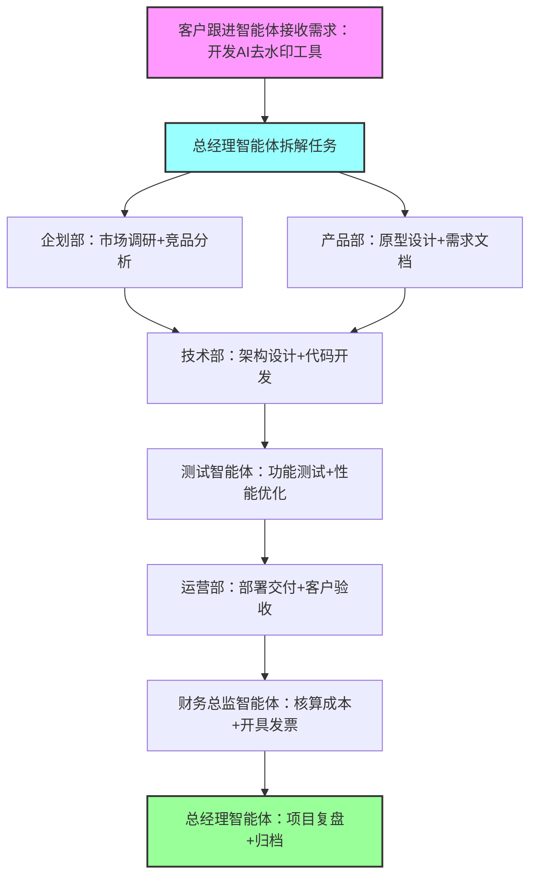

# YDS AI公司建设与项目实施完整方案（V2.0-Trae适配版）

# 一、方案概述

## 1.1 项目背景

随着AI技术在各行业的深度渗透，企业对智能化解决方案的需求呈爆发式增长。为抓住市场机遇，拟组建YDS AI公司，聚焦AI技术研发与落地服务。本方案基于Trae智能开发平台构建公司核心运营体系，通过Trae的智能体协作能力实现部门化分工、全流程自动化运营，降低技术门槛并提升运营效率，打造轻资产、高效率的AI服务型企业。

## 1.2 核心目标

1. **架构搭建**：3个月内完成基于Trae的公司智能体体系搭建，实现各部门角色的数字化映射。

2. **流程落地**：6个月内跑通"市场调研-方案设计-研发交付-运维收款"全业务流程，实现自动化运转。

3. **业务验证**：12个月内完成3个以上标杆项目交付，形成可复制的AI服务模式。

4. **效率提升**：通过Trae智能体协作，将项目交付周期缩短40%，人力成本降低50%。

## 1.3 方案范围

本方案覆盖YDS AI公司从组织架构设计、Trae智能体体系搭建、核心业务流程配置到项目落地验证的全生命周期，具体包括组织架构规划、Trae智能体配置、协作流程设计、安全体系建设、项目实施路径及风险管控等内容。

# 二、组织架构设计

## 2.1 整体架构

采用"扁平化+智能体协同"架构，减少管理层级，通过Trae智能体承担专业分工任务，实现"1名负责人+N个智能体+少量辅助人员"的轻量运营模式。整体分为决策层、业务层、支撑层三个层级，各层级通过Trae共享工作区实现数据同步。

## 2.2 部门设置与职能

|部门|核心职能|Trae智能体配置|辅助人员配置|
|---|---|---|---|
|总经办（决策层）|战略规划、目标拆解、跨部门协调、风险管控|总经理智能体（任务分发、进度监控、决策支持）|1名负责人（CEO）|
|企划部（业务层）|市场调研、竞品分析、需求挖掘、商业方案设计|市场调研智能体、方案撰写智能体、竞品分析智能体|1名市场专员（辅助数据验证）|
|技术部（业务层）|技术选型、架构设计、代码开发、测试调试|架构师智能体、前端开发智能体、后端开发智能体、测试智能体|2名开发工程师（核心技术把关）|
|产品部（业务层）|产品设计、原型制作、用户体验优化、需求管理|产品经理智能体、UI设计智能体、原型生成智能体|1名产品专员（需求对接）|
|运营部（业务层）|客户跟进、项目交付、售后运维、品牌推广|客户跟进智能体、运维监控智能体、内容创作智能体|1名运营专员（客户关系维护）|
|财务部（支撑层）|成本核算、自动记账、预算管理、发票处理|财务总监智能体、记账智能体、税务申报智能体|1名财务专员（票据处理）|
|行政部（支撑层）|会议安排、合同管理、文档归档、资产维护|行政智能体、合同审核智能体、文档管理智能体|1名行政专员（基础事务处理）|
# 三、Trae智能体体系搭建

## 3.1 核心技术支撑

基于Trae平台的三大核心能力构建智能体体系，确保各部门智能体具备专业能力和协同效率：

- **自定义智能体框架**：通过JSON Schema配置智能体人设、职责和工具集，支持按部门需求精准定义能力边界。

- **MCP多工具协作协议**：基于WebSocket实现跨工具双向通信，支持智能体调用Excel、Figma、GitHub等专业工具，解决工具孤岛问题。

- **共享工作区与版本控制**：所有智能体输出结果（方案、代码、报表等）统一存储于Trae共享工作区，通过版本标记实现溯源和冲突管控。

- **流程自动化引擎**：支持可视化配置任务流转规则，实现"需求触发-自动分发-进度反馈-结果归档"全流程自动化。

## 3.2 各部门智能体详细配置

### 3.2.1 总经办-总经理智能体

|配置项|具体内容|
|---|---|
|核心人设|YDS AI公司CEO，具备5年AI行业管理经验，擅长战略拆解和跨部门协调，风格务实高效|
|核心职责|1. 接收外部需求或内部战略目标，按部门职责拆解任务；2. 监控各部门任务进度，识别延期风险；3. 汇总各部门成果，形成决策报告；4. 协调部门间冲突，制定解决方案|
|工具配置|1. MCP调度中枢（用于触发其他智能体任务）；2. 共享工作区（查看各部门输出）；3. 进度监控工具（生成甘特图）；4. 风险分析工具（识别项目风险）|
|触发规则|1. 收到新需求后1小时内完成任务拆解；2. 每日18:00自动汇总各部门进度；3. 检测到任务延期时立即触发告警并生成解决方案|
### 3.2.2 技术部-开发类智能体（以前端开发智能体为例）

|配置项|具体内容|
|---|---|
|核心人设|资深前端开发工程师，精通HTML/CSS/JavaScript及React框架，熟悉移动端适配，注重代码规范|
|核心职责|1. 接收产品原型和需求文档，制定前端开发方案；2. 生成符合Trae Rules规范的代码；3. 配合测试智能体修复BUG；4. 优化前端性能，确保加载速度达标|
|工具配置|1. @Builder代码生成引擎（分层生成代码并验证）；2. 终端工具（执行编译和打包）；3. ESLint/Stylelint工具（代码规范校验）；4. 性能分析工具（检测加载速度）；5. Figma MCP（对接设计稿）|
|输出规范|1. 代码需包含注释和测试用例；2. 生成dist打包文件和部署说明；3. 提交至GitHub MCP进行版本管理；4. 输出性能测试报告（LCP<2.5s）|
### 3.2.3 财务部-财务总监智能体

|配置项|具体内容|
|---|---|
|核心人设|注册会计师，具备科技公司财务管控经验，擅长成本核算和税务筹划|
|核心职责|1. 基于项目方案进行成本核算；2. 自动同步项目收款信息并记账；3. 制定月度预算和成本控制方案；4. 生成财务报表和税务申报资料|
|工具配置|1. Excel MCP（生成成本表和报表）；2. 记账工具（自动录入凭证）；3. 税务计算工具（适配行业税率）；4. 银行API MCP（同步流水）|
|数据来源|1. 企划部方案中的人力和资源估算；2. 运营部的项目收款记录；3. 行政部的费用报销单据；4. 银行流水自动同步|
## 3.3 智能体协作机制设计

### 3.3.1 协作核心逻辑

以总经理智能体为中枢，基于Trae的"需求-拆解-执行-反馈"闭环机制，实现各部门智能体协同工作：

1. **需求接入**：运营部客户跟进智能体接收外部需求，同步至共享工作区并触发总经理智能体。

2. **任务拆解**：总经理智能体按"企划→产品→技术→测试→运营→财务"流程拆解任务，通过MCP协议分发至对应部门智能体。

3. **并行执行**：各部门智能体同步执行任务，通过共享工作区实时共享中间成果（如企划部输出调研报告后，产品部立即启动设计）。

4. **冲突管控**：Trae通过依赖图分析检测工具冲突，采用"资源锁定+增量更新"策略解决并发修改问题（如开发和测试智能体协作时关联代码版本）。

5. **成果汇总**：总经理智能体汇总各部门成果，生成项目交付包并同步至运营部。

### 3.3.2 典型场景协作流程（以AI去水印项目为例）

# 四、核心业务流程配置

## 4.1 业务流程总览

基于Trae流程自动化引擎，配置三大核心业务流程，实现从获客到回款的全自动化：

- **项目交付流程**：覆盖需求对接、方案设计、研发测试、交付验收全环节（核心流程）。

- **运营推广流程**：实现市场素材生成、渠道发布、数据追踪、优化迭代自动化。

- **财务管理流程**：自动完成成本核算、记账、预算管控、税务申报。

## 4.2 关键流程详细配置（项目交付流程）

|流程阶段|执行角色|Trae智能体操作|输出成果|时长要求|
|---|---|---|---|---|
|需求调研阶段|企划部+运营部|1. 市场调研智能体联网分析行业趋势；2. 竞品分析智能体抓取同类产品功能；3. 客户跟进智能体整理需求清单|《市场调研报告》《竞品分析报告》《需求规格说明书》|3个工作日|
|方案设计阶段|产品部+技术部|1. 产品经理智能体设计产品原型；2. 架构师智能体制定技术方案；3. 财务总监智能体核算成本|产品原型、技术架构方案、成本预算表、报价单|2个工作日|
|研发阶段|技术部|1. 前端/后端开发智能体生成代码；2. @Builder引擎优化代码规范；3. 终端工具执行编译打包|源代码、编译文件、开发日志|5-10个工作日（按项目复杂度）|
|测试阶段|技术部|1. 测试智能体生成测试用例；2. 自动执行功能和性能测试；3. 开发智能体修复BUG|测试报告、BUG清单、修复记录|2-3个工作日|
|交付阶段|运营部|1. 运维监控智能体部署产品；2. 客户跟进智能体组织验收；3. 文档管理智能体整理交付包|部署文档、操作手册、验收报告|1个工作日|
|回款阶段|财务部|1. 财务总监智能体生成发票；2. 记账智能体录入收款信息；3. 生成项目利润分析报告|发票、记账凭证、利润分析报告|验收后3个工作日|
## 4.3 流程优化机制

基于Trae的数据分析能力，建立流程优化闭环：

1. **数据采集**：自动记录各流程阶段的耗时、输出质量、智能体调用次数等数据。

2. **瓶颈分析**：每月由总经理智能体生成《流程效率分析报告》，识别耗时过长或冲突频繁的环节。

3. **优化执行**：针对瓶颈环节调整智能体配置（如优化提示词、增加工具集）或流程规则（如调整任务顺序）。

4. **效果验证**：优化后通过测试项目验证效果，形成"采集-分析-优化-验证"的持续迭代机制。

# 五、数据安全与风险管控

## 5.1 数据安全体系建设

基于Trae的安全特性，构建多层级数据安全防护体系：

- **本地处理层**：核心代码和敏感数据（如客户信息）优先在本地执行和存储，Trae支持浏览器端AST解析等本地化操作，减少数据传输风险。

- **数据加密层**：共享工作区数据采用AES-256加密存储，跨智能体传输数据通过TLS加密，确保数据隐私。

- **权限控制层**：通过Trae的角色权限配置，为各部门智能体和人员分配最小操作权限（如财务部智能体仅能访问财务数据）。

- **安全审计层**：开启Trae操作日志功能，记录所有智能体和人员的操作行为，支持异常行为追溯。

## 5.2 核心风险及应对措施

|风险类型|具体表现|应对措施|
|---|---|---|
|智能体能力不足|开发智能体生成代码存在BUG，方案智能体输出内容不专业|1. 建立智能体能力评分机制，低于阈值时触发人工审核；2. 基于优质输出优化提示词，定期更新智能体配置；3. 为核心智能体配置更高性能的模型（如GPT-4 Turbo）|
|协作冲突风险|多智能体同时操作同一文件导致数据覆盖，任务衔接出现断层|1. 启用Trae版本控制和资源锁定功能；2. 配置任务依赖规则（如研发需等待产品原型确认后启动）；3. 每日自动同步协作日志，及时发现断层|
|数据泄露风险|客户敏感信息或核心代码通过智能体工具泄露|1. 开启Trae内容安全网关，过滤敏感信息；2. 限制智能体工具调用范围（如禁止联网工具处理敏感数据）；3. 定期执行安全审计，检查数据访问记录|
|项目延期风险|某部门智能体任务延期导致整体项目滞后|1. 总经理智能体实时监控进度，设置延期预警阈值；2. 配置备用智能体，延期时自动切换；3. 优化任务拆解，增加缓冲时间|
# 六、项目实施路径

## 6.1 实施阶段划分（12个月）

### 第一阶段：基础搭建期（第1-3个月）

- **目标**：完成Trae智能体体系搭建和核心流程配置

- **关键任务**：
        完成各部门智能体创建和配置（第1个月）；

- 搭建共享工作区和权限体系（第1.5个月）；

- 配置项目交付核心流程（第2个月）；

- 进行内部测试，优化智能体协作规则（第3个月）。

- **交付物**：智能体配置清单、共享工作区架构、流程配置文档、内部测试报告

### 第二阶段：试点验证期（第4-6个月）

- **目标**：通过小型试点项目验证体系可行性

- **关键任务**：
        选择1-2个简单项目（如AI文本摘要工具）作为试点（第4个月）；

- 全流程使用Trae智能体协作，记录问题并优化（第5个月）；

- 完成试点项目交付，总结经验并迭代体系（第6个月）。

- **交付物**：试点项目成果、问题清单、体系优化报告

### 第三阶段：规模运营期（第7-9个月）

- **目标**：扩大业务范围，实现标准化交付

- **关键任务**：
        拓展2-3个客户项目，应用优化后的体系（第7-8个月）；

- 沉淀3-5个行业解决方案模板（如教育、电商AI工具）（第8个月）；

- 建立智能体能力知识库，提升专业度（第9个月）。

- **交付物**：客户项目成果、行业解决方案模板、知识库

### 第四阶段：优化升级期（第10-12个月）

- **目标**：提升效率和盈利能力，形成核心竞争力

- **关键任务**：
        基于运营数据优化流程，将交付周期缩短40%（第10-11个月）；

- 拓展MCP工具生态，集成更多行业专用工具（第11个月）；

- 总结运营模式，制定规模化扩张计划（第12个月）。

- **交付物**：效率优化报告、工具集成清单、扩张计划

## 6.2 资源投入计划

|资源类型|投入明细|预估成本（年）|
|---|---|---|
|人力成本|7名核心人员（1CEO+1市场+2开发+1产品+1运营+1财务）|80-100万元|
|技术资源|Trae专业版（如需高级功能）、服务器（本地部署可选）、模型调用费用|5-8万元|
|运营资源|市场推广费用、客户接待费用、办公场地租金|15-20万元|
|其他成本|软件采购、培训、法务咨询等|5-7万元|
|总计|-|105-135万元|
# 七、效果预期与评估指标

## 7.1 业务效果预期

- **项目交付能力**：年交付10-15个中小型AI项目，客户满意度≥90%。

- **效率提升**：单人产出效率提升3倍，项目交付周期从传统30天缩短至15天以内。

- **成本控制**：相比传统AI公司，人力成本降低50%，运营成本降低30%。

- **市场拓展**：形成2-3个优势行业解决方案，积累15-20个稳定客户。

## 7.2 核心评估指标（KPI）

|指标类型|具体指标|目标值|数据来源|
|---|---|---|---|
|效率指标|项目平均交付周期|≤15天|Trae流程日志|
|效率指标|智能体任务自动化率|≥80%|Trae智能体调用统计|
|质量指标|项目验收通过率|||
> （注：文档部分内容可能由 AI 生成）