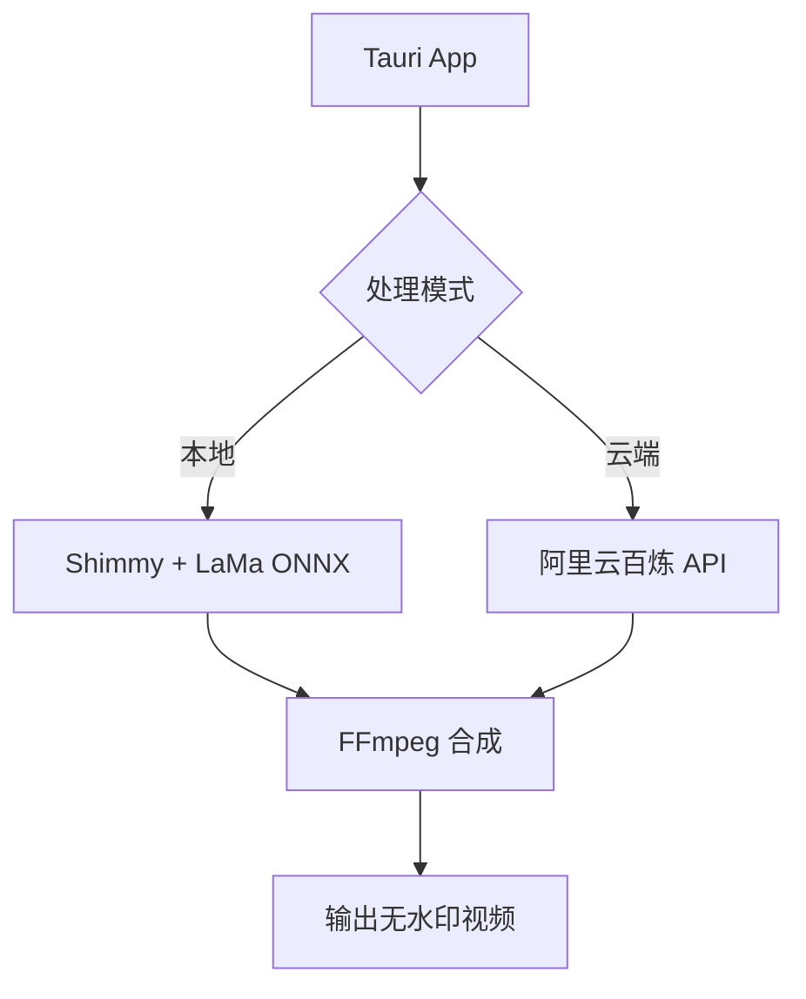

# 📄 视频去水印工具快速产品化与上架任务书

> **版本**：v1.0  
> **目标**：30天内发布一款可商用的"智能视频去水印"桌面应用，实现月收入 ¥2,000+  
> **核心策略**：轻资产、端侧优先、混合部署、快速迭代  
> **适用设备**：华硕 GL552VW 笔记本（24GB DDR4）、贵阳台式机（i5-3470 + 32GB RAM）

---

## 🎯 一、项目目标

| 指标 | 目标值 |
|------|--------|
| **MVP 上线时间** | 第 7 天 |
| **正式版上架时间** | 第 21 天 |
| **首月用户数** | ≥ 500 |
| **付费转化率** | ≥ 5% |
| **月收入** | ≥ ¥2,000 |
| **单用户处理成本** | ¥0（本地版） / ¥0.6（云加速版） |

---

## 🧩 二、产品定位

### 1. 产品名称（暂定）
- **DeWatermark AI**
- **ClearFrame**
- **AutoDeLogo**

### 2. 目标用户
- 抖音/快手/B站内容创作者
- 教培机构教师（去除PPT水印视频）
- 自媒体运营者（二次剪辑去来源水印）
- 学生党（处理课程视频）

### 3. 核心价值
- ✅ **完全离线**：不上传视频，保护隐私
- ✅ **一键去水印**：自动检测 + 修复，无需手动画遮罩
- ✅ **双模式选择**：
  - 免费版：本地处理（慢但免费）
  - 专业版：云加速（快，¥9.9/月）

---

## 🚀 三、技术架构（混合部署）

### 3.1 核心组件

| 组件 | 说明 |
|------|------|
| **Tauri** | 构建轻量级桌面应用（安装包 < 50MB） |
| **Shimmy** | 本地运行 LaMa/TinyLlama-Vision 模型 |
| **LaMa (ONNX)** | CPU 推理，无需 GPU |
| **阿里云百炼** | 提供 SD4 Turbo 去水印 API（¥0.6/分钟） |
| **FFmpeg** | 视频抽帧与合成（GTX960，2M显存 硬编加速） |

### 3.2 技术栈选择
- **前端框架**：Tauri + React/Vue
- **后端处理**：Rust + Python
- **AI模型**：
  - 本地：LaMa (ONNX Runtime)
  - 云端：阿里云百炼视频处理API
- **视频处理**：FFmpeg
- **水印检测**：Shimmy算法

### 3.3 部署架构
- **客户端**：Tauri打包的桌面应用
- **本地处理**：完全离线，无需网络
- **云端加速**：可选的付费服务

---

## 🗓️ 四、30天执行计划（倒计时推进）

### 🔹 第1–3天：MVP开发
- [ ] 完成 process_frames.py 脚本（抽帧 + Shimmy 推理 + 合成）
- [ ] 验证单帧去水印效果（LaMa ONNX）
- [ ] 搭建 Tauri 基础界面（文件上传 + 进度条）
- [ ] 实现本地模式调用 Shimmy API

### 🔹 第4–7天：MVP测试与优化
- [ ] 测试10秒/30秒/1分钟视频处理耗时
- [ ] 优化抽帧策略（select=gt(scene\,0.3)）
- [ ] 添加"分辨率自适应"功能（>720p 自动降级）
- [ ] 打包第一个可运行版本（.exe）

### 🔹 第8–14天：专业版功能开发
- [ ] 接入阿里云百炼 API（SD4 Turbo 去水印）
- [ ] 实现"云加速"按钮（弹出支付二维码）
- [ ] 添加用户账户系统（简单 token 记录）
- [ ] 设计付费页面（微信/支付宝收款码）

### 🔹 第15–21天：UI/UX 优化与打包
- [ ] 设计简洁美观的前端界面（Figma 草图）
- [ ] 添加使用教程弹窗
- [ ] 生成代码签名证书（防止杀毒误报）
- [ ] 打包 Windows 安装包（NSIS）

### 🔹 第22–30天：上架与推广
- [ ] 发布至：
  - 小众软件
  - 马克喵
  - GitHub Releases
  - 应用宝
  - 百度软件中心
- [ ] 制作宣传视频（B站/抖音发布）
- [ ] 在知乎、V2EX、CSDN 发帖引流
- [ ] 收集用户反馈，启动 V2.0 规划

---

## 📦 五、交付物清单

| 文件 | 路径 | 说明 |
|------|------|------|
| **decontam-v1.0.exe** | dist/ | MVP 可执行文件 |
| **installer.exe** | dist/ | 正式版安装包 |
| **process_frames.py** | scripts/ | 核心处理脚本 |
| **shimmy_config.json** | config/ | 模型路径配置 |
| **pricing.md** | docs/ | 价格策略说明 |
| **tutorial.mp4** | docs/ | 使用教程视频 |

---

## 💰 六、商业模式设计

### 1. 免费版（引流）
- **功能**：仅支持 ≤30秒视频，720p 分辨率
- **处理方式**：本地 Shimmy + LaMa
- **广告**：启动页展示"升级专业版"

### 2. 专业版（变现）
- **价格**：¥9.9/月 或 ¥68/年
- **功能**：
  - 无时长限制
  - 支持 1080p/4K
  - 云加速（SD4 Turbo，速度提升 10x）
  - 批量处理
- **支付**：微信/支付宝扫码付款 → 输入激活码

### 3. 成本控制

| 项目 | 成本 |
|------|------|
| **本地处理** | ¥0 |
| **云加速（阿里云百炼）** | ¥0.6/分钟 |
| **用户平均使用时长** | 2分钟/次 → ¥1.2/次 |
| **月服务100次** | ¥120 |
| **月收入目标（¥2,000）→ 需 26 位付费用户** |  |

**✅ 盈亏平衡点极低，商业可行！**

---

## ⚠️ 七、风险与应对

| 风险 | 应对方案 |
|------|----------|
| **杀毒软件误报** | 使用代码签名证书（DigiCert 或 Sectigo） |
| **用户嫌本地处理太慢** | 强调"隐私安全"，提供"云加速"选项 |
| **模型效果不佳** | 提供"手动调整mask"高级功能（V2.0） |
| **竞品抄袭** | 快速迭代，建立用户社群，积累口碑 |

---

## 📢 八、推广策略

### 内容营销
- 发布"AI去水印实测"视频（B站/抖音）
- 撰写《如何批量去除短视频水印》知乎文章

### 社区运营
- 在 V2EX、CSDN、掘金发帖
- 加入"AI工具创业"微信群

### 种子用户
- 免费赠送10个专业版名额，换取真实评价

### SEO优化
- 网站标题包含"去水印软件""视频去logo"等关键词

---

## 📞 九、技术支持与资源

| 资源 | 链接 |
|------|------|
| **Shimmy GitHub** | `https://github.com/shimmy-ai/shimmy` |
| **LaMa ONNX** | `https://huggingface.co/advantch/lama-onnx` |
| **阿里云百炼** | `https://bailian.aliyun.com` |
| **Tauri 文档** | `https://tauri.app` |
| **FFmpeg 下载** | `https://www.gyan.dev/ffmpeg/builds/` |
---

**项目负责人**：技术负责人  
**创建时间**：2025年1月16日  
**预计完成时间**：2025年2月15日  
**状态**：待启动