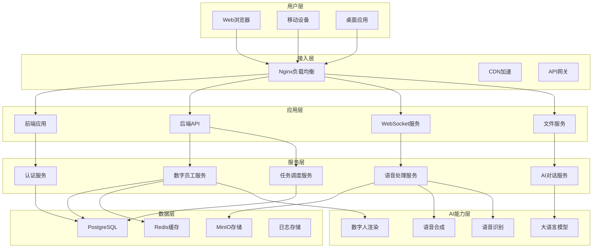
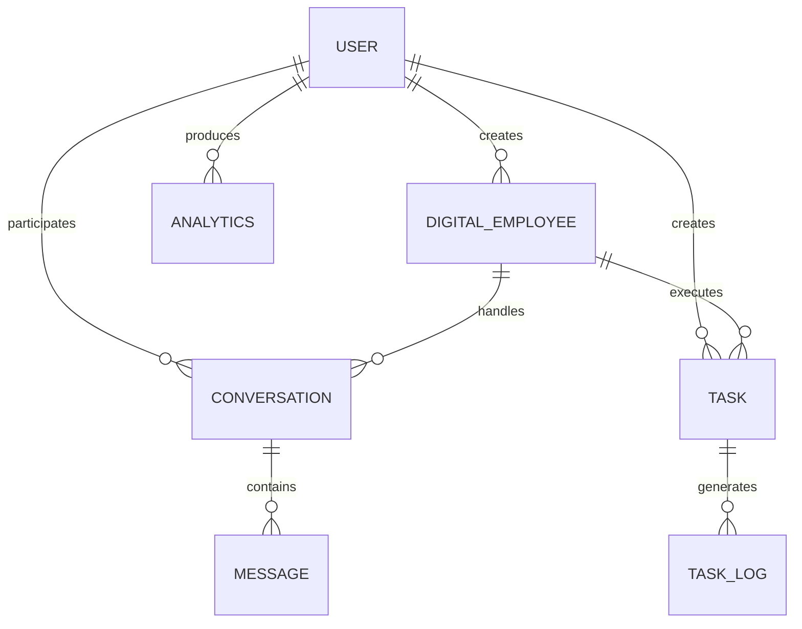

# 系统架构设计文档

## 概述

数字员工系统采用现代化的微服务架构，基于容器化部署，支持高可用、高并发和弹性扩展。系统整合了AI大模型、语音合成、数字人渲染等先进技术，提供完整的数字员工解决方案。

## 架构原则

1. **前后端分离**: 前端负责UI展示，后端负责业务逻辑
2. **微服务架构**: 按业务领域划分服务，独立部署和扩展
3. **容器化部署**: 使用Docker容器化技术，确保环境一致性
4. **云原生设计**: 支持云端部署和弹性伸缩
5. **安全优先**: 多层次安全防护，确保数据安全

## 总体架构



## 前端架构

### 技术栈
- **框架**: React 18 + TypeScript
- **状态管理**: Zustand
- **路由**: React Router v6
- **UI组件**: Ant Design + Tailwind CSS
- **构建工具**: Vite
- **HTTP客户端**: Axios

### 架构设计
```
src/
├── components/     # 可复用组件
├── pages/         # 页面组件
├── hooks/         # 自定义Hooks
├── services/      # API服务层
├── store/         # 状态管理
├── utils/         # 工具函数
└── types/         # 类型定义
```

### 核心模块
1. **用户认证模块**: 登录、注册、权限管理
2. **数字员工模块**: 数字人创建、配置、管理
3. **对话交互模块**: 实时对话、历史记录
4. **任务管理模块**: 任务创建、调度、执行
5. **数据分析模块**: 使用情况统计、性能分析

## 后端架构

### 技术栈
- **运行时**: Node.js + TypeScript
- **Web框架**: Express.js
- **数据库**: PostgreSQL (Supabase)
- **缓存**: Redis
- **文件存储**: MinIO
- **认证**: JWT

### 架构设计
```
api/
├── controllers/    # 控制器层
├── services/      # 业务逻辑层
├── models/        # 数据模型层
├── middleware/    # 中间件层
├── routes/        # 路由定义
├── utils/         # 工具函数
└── config/        # 配置文件
```

### 核心服务

#### 1. 认证服务 (Auth Service)
```typescript
interface AuthService {
  login(email: string, password: string): Promise<AuthResult>
  register(userData: UserData): Promise<User>
  refreshToken(refreshToken: string): Promise<AuthResult>
  validateToken(token: string): Promise<User>
}
```

#### 2. 数字员工服务 (Digital Employee Service)
```typescript
interface DigitalEmployeeService {
  createEmployee(config: EmployeeConfig): Promise<DigitalEmployee>
  updateEmployee(id: string, config: EmployeeConfig): Promise<DigitalEmployee>
  deleteEmployee(id: string): Promise<void>
  getEmployee(id: string): Promise<DigitalEmployee>
  listEmployees(filters: FilterOptions): Promise<EmployeeList>
}
```

#### 3. 对话服务 (Conversation Service)
```typescript
interface ConversationService {
  startConversation(employeeId: string, userId: string): Promise<Conversation>
  sendMessage(conversationId: string, message: Message): Promise<MessageResponse>
  getHistory(conversationId: string): Promise<Message[]>
  endConversation(conversationId: string): Promise<void>
}
```

#### 4. 任务调度服务 (Task Service)
```typescript
interface TaskService {
  createTask(taskData: TaskData): Promise<Task>
  scheduleTask(taskId: string, schedule: Schedule): Promise<void>
  executeTask(taskId: string): Promise<TaskResult>
  getTaskStatus(taskId: string): Promise<TaskStatus>
  cancelTask(taskId: string): Promise<void>
}
```

## 数据架构

### 数据库设计

#### 核心实体


#### 主要表结构

**用户表 (users)**
```sql
CREATE TABLE users (
  id UUID PRIMARY KEY DEFAULT gen_random_uuid(),
  username VARCHAR(50) UNIQUE NOT NULL,
  email VARCHAR(100) UNIQUE NOT NULL,
  password_hash VARCHAR(255) NOT NULL,
  role VARCHAR(20) DEFAULT 'user',
  status VARCHAR(20) DEFAULT 'active',
  created_at TIMESTAMP DEFAULT NOW(),
  updated_at TIMESTAMP DEFAULT NOW()
);
```

**数字员工表 (digital_employees)**
```sql
CREATE TABLE digital_employees (
  id UUID PRIMARY KEY DEFAULT gen_random_uuid(),
  name VARCHAR(100) NOT NULL,
  description TEXT,
  avatar_url VARCHAR(255),
  voice_config JSONB,
  personality_config JSONB,
  capabilities JSONB,
  owner_id UUID REFERENCES users(id),
  created_at TIMESTAMP DEFAULT NOW(),
  updated_at TIMESTAMP DEFAULT NOW()
);
```

**对话表 (conversations)**
```sql
CREATE TABLE conversations (
  id UUID PRIMARY KEY DEFAULT gen_random_uuid(),
  employee_id UUID REFERENCES digital_employees(id),
  user_id UUID REFERENCES users(id),
  status VARCHAR(20) DEFAULT 'active',
  started_at TIMESTAMP DEFAULT NOW(),
  ended_at TIMESTAMP
);
```

### 缓存策略

#### Redis缓存设计
```typescript
interface CacheStrategy {
  // 用户会话缓存
  userSession: {
    key: 'session:${userId}',
    ttl: 3600, // 1小时
    data: UserSession
  }
  
  // 数字员工配置缓存
  employeeConfig: {
    key: 'employee:${employeeId}',
    ttl: 1800, // 30分钟
    data: EmployeeConfig
  }
  
  // 对话历史缓存
  conversationHistory: {
    key: 'conversation:${conversationId}',
    ttl: 300, // 5分钟
    data: Message[]
  }
}
```

## AI能力集成

### 大语言模型集成
```typescript
interface LLMService {
  generateResponse(
    prompt: string,
    context: ConversationContext,
    model?: string
  ): Promise<string>
  
  streamResponse(
    prompt: string,
    context: ConversationContext,
    onChunk: (chunk: string) => void
  ): Promise<void>
}
```

### 语音处理服务
```typescript
interface VoiceService {
  textToSpeech(
    text: string,
    voiceConfig: VoiceConfig
  ): Promise<AudioBuffer>
  
  speechToText(
    audioBuffer: AudioBuffer,
    language?: string
  ): Promise<string>
  
  cloneVoice(
    audioSamples: AudioBuffer[],
    targetText: string
  ): Promise<AudioBuffer>
}
```

### 数字人渲染服务
```typescript
interface AvatarService {
  generateVideo(
    audio: AudioBuffer,
    avatarConfig: AvatarConfig
  ): Promise<VideoBuffer>
  
  syncLipMovement(
    audio: AudioBuffer,
    video: VideoBuffer
  ): Promise<VideoBuffer>
  
  customizeAppearance(
    baseModel: string,
    customizations: AppearanceConfig
  ): Promise<AvatarModel>
}
```

## 安全架构

### 认证授权
```typescript
interface SecurityConfig {
  // JWT配置
  jwt: {
    secret: string
    expiresIn: string
    refreshExpiresIn: string
  }
  
  // 密码策略
  password: {
    minLength: number
    requireUppercase: boolean
    requireNumbers: boolean
    requireSpecialChars: boolean
  }
  
  // 访问控制
  rbac: {
    roles: string[]
    permissions: Record<string, string[]>
  }
}
```

### 数据安全
- **传输加密**: HTTPS/TLS
- **存储加密**: 敏感数据AES加密
- **API安全**: Rate limiting, CORS, CSRF防护
- **审计日志**: 用户操作记录

## 性能架构

### 缓存策略
1. **多级缓存**: 浏览器缓存 → CDN缓存 → Redis缓存
2. **缓存更新**: 写穿透、写回、异步更新
3. **缓存失效**: TTL过期、主动失效、版本控制

### 负载均衡
```yaml
# Nginx负载均衡配置
upstream api_servers {
  server api1:3001 weight=3;
  server api2:3001 weight=2;
  server api3:3001 weight=1;
  
  # 健康检查
  health_check interval=5s fails=3 passes=2;
}
```

### 数据库优化
- **索引优化**: 复合索引、部分索引、表达式索引
- **查询优化**: 查询计划分析、慢查询优化
- **连接池**: 连接复用、连接池配置
- **读写分离**: 主从复制、读写分离

## 监控架构

### 应用监控
```typescript
interface MonitoringConfig {
  // 性能指标
  metrics: {
    responseTime: boolean
    errorRate: boolean
    throughput: boolean
    resourceUsage: boolean
  }
  
  // 日志配置
  logging: {
    level: string
    format: string
    destinations: string[]
  }
  
  // 告警配置
  alerting: {
    thresholds: Record<string, number>
    channels: string[]
  }
}
```

### 基础设施监控
- **容器监控**: Docker stats, cAdvisor
- **主机监控**: CPU、内存、磁盘、网络
- **服务监控**: 服务可用性、响应时间
- **业务监控**: 用户行为、功能使用

## 部署架构

### 容器化部署
```dockerfile
# 前端Dockerfile
FROM node:18-alpine as builder
WORKDIR /app
COPY package*.json ./
RUN npm ci --only=production
COPY . .
RUN npm run build

FROM nginx:alpine
COPY --from=builder /app/dist /usr/share/nginx/html
COPY nginx.conf /etc/nginx/nginx.conf
EXPOSE 80
CMD ["nginx", "-g", "daemon off;"]
```

### 环境配置
```yaml
# docker-compose.prod.yml
version: '3.8'
services:
  api:
    image: digital-employee-api:latest
    environment:
      - NODE_ENV=production
      - DATABASE_URL=${PROD_DATABASE_URL}
      - REDIS_URL=${PROD_REDIS_URL}
    deploy:
      replicas: 3
      resources:
        limits:
          memory: 1G
        reservations:
          memory: 512M
    healthcheck:
      test: ["CMD", "curl", "-f", "http://localhost:3001/health"]
      interval: 30s
      timeout: 10s
      retries: 3
```

## 扩展性设计

### 水平扩展
- **无状态服务**: API服务无状态化设计
- **会话管理**: 分布式会话存储
- **数据分片**: 数据库水平分片
- **缓存集群**: Redis集群模式

### 垂直扩展
- **资源优化**: 代码优化、算法优化
- **硬件升级**: CPU、内存、存储升级
- **架构优化**: 微服务拆分、服务解耦

## 灾备架构

### 数据备份
- **定期备份**: 全量备份、增量备份
- **异地备份**: 跨地域备份存储
- **备份验证**: 定期恢复测试

### 故障恢复
- **服务降级**: 核心功能优先保障
- **故障转移**: 自动故障检测和切换
- **数据恢复**: 快速数据恢复机制